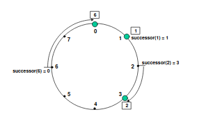
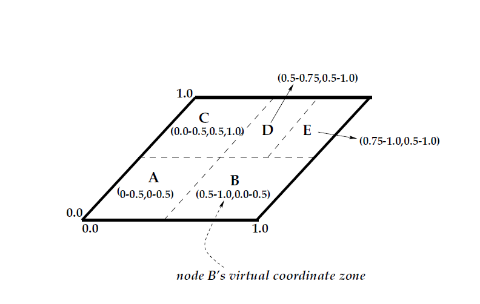
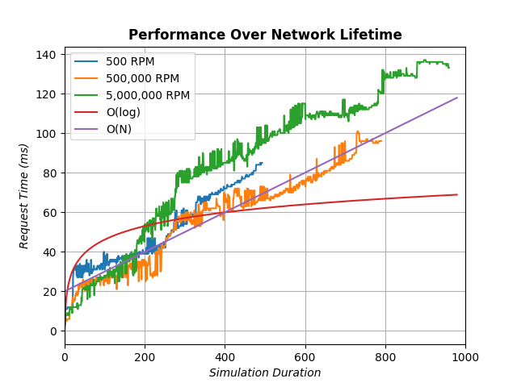
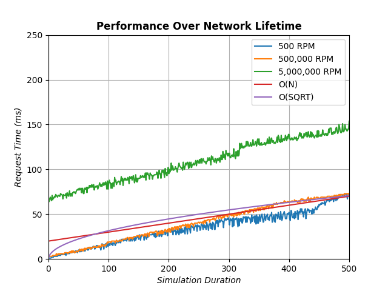

# CS441 Course Project: Akka Overlay Network Simulator
### Group 7: *Jacob DiStefano, Chris Cortina, Peter Huynh*

## Chord
The Chord algorithm is an algorithm which places computational servers in a ring configuration to allow dynamic entry and exit, servers are arranged in relation to one another as specified in the [MIT Chord Paper](https://pdos.csail.mit.edu/papers/chord:sigcomm01/chord_sigcomm.pdf). 

Servers in a Chord Network, referred to in the rest of this document as *nodes*, are arranged in a ring as shown in the below figure



Positions on this ring are dependent on each node's unique hash, which must be found using consistent hashing. The integer value of this hash lies between [0, 2^m - 1] where *m* is the number of bits in the hash.

Each node at all times must keep track of its immediate successor, which is the closest node that liest clockwise on the ring. Each node also maintains a reference to its predecessor, though this is not necessarily required for computations. Data in this network is the responsibility of each node, which is responsible for any data which has a hash in the interval [node.hash, node.successor.hash)

In order to speed up reads and writes in the network, each node maintains a finger table, which allows it to direct requests nodes in the network further than its successor. Utilizing this finger table can reduce lookups from *O(n)* time when traversing via successors, to *O(logn)* where *n* is the number of nodes in the network. Each entry in this finger table has the following fields |start, node, address| where the start represents a position on the ring, node represents the successor node to that position, and address is a way to contact that node.

The chord algorithm allows nodes to dynamically enter and leave the network, with minimal distruption to lookups and data permenance. In order to maintain this network, a node frequently checks in with its predecessor and successor, and occassionally checks in on its finger table entries in a process called stabilization.

### Akka Chord Implementation
***For incredibly minute and specific details on the conversion from chord paper psuedocode to Akka messages check out `chord.txt`***

To simulate Chord we chose to use Akka actors to represent servers in a decentralized distributed cloud network, using the *typed akka behaviors model*. Each individual actor represents a single computer or server in the network. For consistent hashing we chose to use 128 bit md5 hashes, assigning each node, datapoint, and position on the ring an integer value from [0, 2^128 - 1]. To simulate communicate between computers over a network we use the `ActorRef` of each actor to represent an IP address or TCP connection. This reference allows each node to send a message to one another.

To ensure that hash values are interpreted as 128 bit non-negative integers, the utility function `hashVal()` converts interprets bytes in an md5 hash as a positive Scala `BigInt`, which is backed up by Java's `BigInteger` class.

To make better use of Akka's focus on the Actor Model, we chose to reduce the amount of blocking and RPC calls between nodes present in the original paper. Instead we chose to utilize the fire and forget pattern of sending messages in Akka, allowing each node to complete a small part of the computation before going about its business.

The primary function in a chord network is `find_successor`, in which the successor to a key *k* is found. Our implementation does by sending message asking a node in the network whether it is the predecessor of the key, or if it is the only node in the network. In this case the node simply replies to the initial sender with its successor. Otherwise the node finds the closest preceding finger table entry and sends a message to that node asking whether it is the predecessor of the key. This process is minimally expensive for each node, and does not block any node in the network. This logic is found in the utitlity function `tryFindSuccessor()` which combines the logic of `find_successor()` and `closest_preceding_finger()`.

To determine whether a node is the successor of a key the utility functions `inInterval()` and `ringDistance()` are used heavily. These functions determine whether a key is in a specific interval on the ring, and the absolute value distance between them. Both of these functions make special care to allow intervals over the maximum 128 bit value, as if there were an interval going across the top of the ring. In addition intervals are allowed to be inclusive or exclusive at their limits.

In our simulation a bootstrapper node is responsible for creating nodes and giving them references to existing nodes. The first node in the network is given a null reference, which it then ignores and initializes its finger table with itself in all entries, as well as having itself as its own predecessor. When subsequent nodes enter the network they are given a reference to an existing node, which assists it in initiailzation. This new node creates its finger table with null entries, then asks the existing node who its successor is. When the new node recieves its successor, it places the successor in each finger table entry until it is no longer a valid successor to a finger table entry. The node then asks for the next finger table entry successor, and repeats this process until the finger table is filled. It is important to note that the new node only makes a request for a successor when it needs to, and does not block while the successor request is made.

When a new node has a full finger table and has recieved its predecessor, the node is then marked as active. After becoming active it uses the scheduler to schedule periodic checks on its successor and checks on random finger table entries to ensure that its successor pointer and finger table are valid at all times. When a node is notified that it has a new predecessor, it writes any keys that its predecessor is now the successor of, to its predecessor.

When the simulator decides to drop a node, the simulator sends a message to the bootstrapper telling it to drop a node, which then sends a message to the node telling it to leave the network. This node then sends a message to its successor, and all nodes that may have the dropped node in its finger table. After this it sets its behavior to `Behaviors.stopped` and has essentially left the network.

In this project, we used the functional approach for the typed actors. Which does not have mutable states associated with any actor. Updating the states of the actors is by recursive calls to the functions that return the behavior of the actor. Then the actors will process the next message in the mailbox.

### Akka CAN Implementation

Each Akka Actor represents a Node, which can contain multiple zones, as the original CAN paper permits for a Node to have many zones in the case of a failure. 

The overall structure of the CAN alogorithm is similar, in terms of overhead (simulating clients, world stopping capabilites), and so the CAN implementation has the same structure as Chord but the implemntation
details of the alogirthm are different. To make our simulation easier, partitioning the 128-bit hash into the coordinate space can only occur powers of 2, as to not deal with certain dimensions having bigger overall magnitudes than others.   

Through the utility functions in CAN.Util, on each Node join a random hash is computed, and that Zone which the point lands on is cut. As for reads and writes, the hash of the movie title is taken and a random node is chosen to start the routing. Through a simple euclidean distance calculation, found in our com.overlay.CAN.Util, each Zone's neighbors distance from the target point is calculated, and the smallest distance required is chosen as the next Zone to route to. 


## Cluster Sharding
Since cluster sharding feature has it own way to locate actors across different nodes, our Chord and CAN algorithm purposes are also location of actors in the cluster, we decided that cluster sharding is not compatible with either algorithm.

Even though we did not make use of actors location of cluster sharding, we successfully add it to CAN and Chord. Instead of hosting actors with one movie each, the cluster node hosts the Simulator actor. So there is a single shard in the cluster contains a single Simulator actor. 

In the pure implementation of Chord or CAN, messages are sent directly to the Simulator actor. With cluster sharding, messages are sent to the ShardRegionRef actor. We only have one shard here, but theoretically, this actor will locate the shard that has the target actor, where the messages will be delivered.

## Simulation
The simulation is created based on a json file containing parameters for the simulation. Parameters include the number of computers (nodes), min/max requests per minute, movie data list etc. This configuration is loaded in via an HTTP endpoint, which waits for a given configuration before beginning the simulation. The json file also includes a parameter to determine whether the Chord or CAN simulator is run.

The simulator first creates Client actor(s) for the simulator, the client(s) then determine how many requests it will make per minute. This value is randomly determined based on the range given in the configuration, in Monte Carlo fashion. These clients will then make these read/write requests for a random movie, which go through the simulator and to the simulated network. These requests are processed by the network and responses are sent back to the simulator, and the time to fulfill the request is logged. On every pause a random number between 0.0 and 1.0 is generated, if it is less than the `nodeFailureChance` specified in the json file, then the simulator will force one node to leave the network.

The simulation ends after the duration specified in the input json. The results of the simulation are dumped to `results.yaml` which stores the read and write requests, including the time to fulfill the requsest. In addition the network activity, such as node joins, initilization, and finger table statuses are logged in `logs.yaml`.

## Analysis
Our simulation used the sample_input configuration (```src/main/resources/sample_input.json```) with varying read and write amounts. We randomly distributed the reads and writes, throughout a random interval controlled by the amount of requests allowed per minute in the configuration. 



In the graph above, there are five plotted lines. Blue, Orange, and Green representing the length of each request over the duration of the simulation for 500, 500,000, and 5,000,000 requests per minute (RPM), and the Red and Purple are simple Linear and Logarthmic graphs for easy comparison.

The time a request took is charted against the length of the simulation, and on analysis of the data, as the network became more and more congested with requests, there was an obvious slowdown toward middle and latter-end requests. Whereas requests in the 200 time mark and before followed logarthmic efficiency, the congestion of the network eventually, especially when tested on millions of requests, dramatically slowed down the idealized efficiency of logarthmic performance for Chord.



There are five lines plotted above, for the same variety of responses per minute as the Chord implementation. In addition, the squareroot function is charted above as that is the expected time complexity of the algorithm, with the dimensions being equal to 2. 

As you can see, our RPMs performance for each of the configuration models at worst to linear time, but in periods of meager RPM, for example 500 RPM (Blue) between 300ms and 400ms on the X-axis, O(SQRT) performance is achieved. Congestion, like in our Chord implemntation, unfortunately caused all requests time to increase by a constant factor, as you can see by the 5_000_000 (Green) having each request time be at least 50ms slower than the other RPM configurations.

## Building The Project
1. Navigate to the project folder
2. Run command `sbt clean run` to run the start the HTTP endpoint, `sbt clean test` to run unit tests
3. Make an HTTP POST request with the configuration file for the simulation. An example config is in ```src/main/resources/sample_input.json```
    - This can be done in the command line via `cat src/main/resources/sample_input.json | http POST localhost:8080/configuration`, this does require the package `httpie`. Check out [this page](https://pypi.org/project/httpie/#installation) for detailed install instructions
    - This can also be done in a more user friendly way through the application [POSTman](https://www.postman.com/). POST requests are still sent to `localhost:8080/configuration`
4. Analyze the program flow using the output logs in ```logs.yaml``` which contain each node's respective fingertable and data (movies)
5. ```results.yaml``` contains the logs for read and write requests, and how long each request took since their initial dispatch from the ```Client``` actor
	- To get the graph as shown in the analysis, run `python3 process.py` in the `analysis` folder. This script does expect files named `sample_run_(one/two/three).yaml` in the `analysis` folder, copies of `results.yaml` on successive runs
	
## Run the project via Docker
1. Have docker deamon running (could do so by having docker desktop running).
2. Navigate to the project folder
3. Run `sbt docker:stage`
4. Then, run `sbt docker:publishLocal` to publish image as local
5. Run the project by command `docker run --network host akka-chord-simulator:1.0`
6. Continue step 3 of ***Building The Project*** above.

**Note:*** We have shared with Mr Abhijeet a private docker repository named `chuynh7/group7_cs441_uic_fall2020` .
He could pull the image and run the container.

We could not test if it runs successfully when it is pulled because even docker pro account only allows one collaborator.